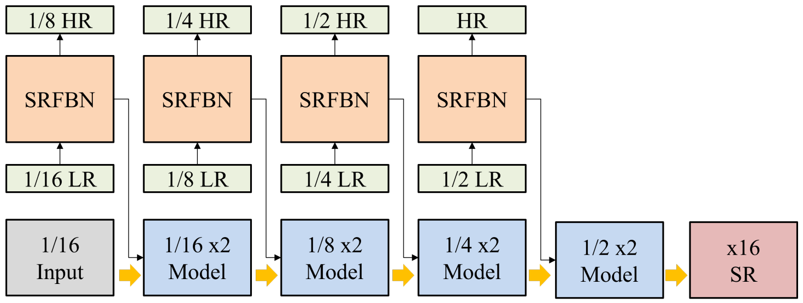
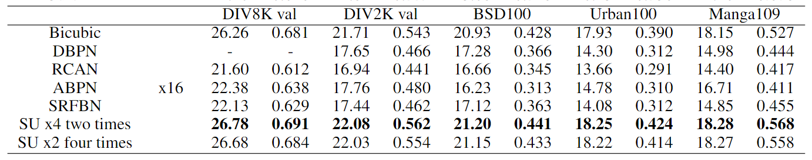

# Sequential Upscaling using Feedback Network

This repository is Pytorch code for our proposed SU-SRFBN.

The code is developed by [aura1999](https://github.com/aura1999jmpark) and [Seonyoo-Kim](https://github.com/SeonYoo-Kim) based on [SRFBN](https://github.com/Paper99/SRFBN_CVPR19), and tested on Ubuntu 20.04 environment with 3090Ti GPU.



If you find this work useful in your research or publications, please consider citing:

```latex
@inproceedings{li2019srfbn,
    author = {Li, Zhen and Yang, Jinglei and Liu, Zheng and Yang, Xiaomin and Jeon, Gwanggil and Wu, Wei},
    title = {Feedback Network for Image Super-Resolution},
    booktitle = {The IEEE Conference on Computer Vision and Pattern Recognition (CVPR)},
    year= {2019}
}

@inproceedings{wang2018esrgan,
    author = {Wang, Xintao and Yu, Ke and Wu, Shixiang and Gu, Jinjin and Liu, Yihao and Dong, Chao and Qiao, Yu and Loy, Chen Change},
    title = {ESRGAN: Enhanced super-resolution generative adversarial networks},
    booktitle = {The European Conference on Computer Vision Workshops (ECCVW)},
    year = {2018}
}
```

## Contents
1. [Requirements](#Requirements)
2. [Test](#test)
3. [Train](#train)
4. [Results](#results)
5. [Acknowledgements](#acknowledgements)

## Requirements
- Python 3 (Anaconda is recommended)
- skimage
- imageio
- Pytorch (Pytorch version >=0.4.1 is recommended)
- torchvision
- tqdm 
- pandas
- cv2 (pip install opencv-python)
- Matlab 

## Test

#### Test on your own images

1. Clone this repository:

   ```shell
   git clone https://github.com/SeonYoo-Kim/SU-SRFBN.git
   ```


2. Download our pre-trained models from the links below, and place them to `./models`.

   [[GoogleDrive]](https://drive.google.com/drive/folders/1dJyMGNaUPzHWU1YVNlTC1YMpViMFsf5c?usp=sharing)


3. Place your own images to `./results/LR/MyImage`.

   
4. cd to `SU-SRFBN` and run **one of following commands** :  <br/>
   If you already have `./results/SR` folder, make sure there's nothing in it.

   ```shell
   # SU-SRFBN-L x16 (x2 four times)
   sh test_SUFBN_L_x2x2x2x2.sh

   # SU-SRFBN-L x16 (x4 two times)
   sh test_SUFBN_L_x4x4.sh
   
   # SU-SRFBN-S x16 (x2 four times)
   sh test_SUFBN_S_x2x2x2x2.sh

   # SU-SRFBN-S x16 (x4 two times)
   sh test_SUFBN_S_x4x4.sh
   ```

5. Finally, PSNR/SSIM values for your images are shown on your screen, you can find the reconstruction images in `./results`.


## Train

1. Download training set DIV2K [[Official Link]](https://data.vision.ee.ethz.ch/cvl/DIV2K/) or DF2K [[GoogleDrive]](https://drive.google.com/drive/folders/1B-uaxvV9qeuQ-t7MFiN1oEdA6dKnj2vW?usp=sharing) [[BaiduYun]](https://pan.baidu.com/s/1CFIML6KfQVYGZSNFrhMXmA#list/path=%2F) (provided by [BasicSR](https://github.com/xinntao/BasicSR)).

2. Run `./scripts/Prepare_TrainData_HR_LR.m` in Matlab to generate HR/LR training pairs with corresponding degradation model and scale factor. (**Note**: Please place generated training data to **SSD (Solid-State Drive)** for fast training)

3. Run `./results/Prepare_TestData_HR_LR.m` in Matlab to generate HR/LR test images with corresponding degradation model and scale factor, and choose one of SR benchmark for evaluation during training.

4. Edit `./options/train/train_SRFBN_example.json` for your needs according to [`./options/train/README.md`.](./options/train/README.md)

5. Then, run command:
   ```shell
   cd SU-SRFBN
   python train.py -opt options/train/train_M-FBN-S_x4_2.json
   ```

6. You can monitor the training process in `./experiments`.

7. Finally, you can follow the **test pipeline** to evaluate your model.

## Results

#### Quantitative Results




## Acknowledgements

- Thank [penguin1214](https://github.com/penguin1214), who accompanies me to develop this repository.
- Thank [Xintao](https://github.com/xinntao). Our code structure is derived from his repository [BasicSR](https://github.com/xinntao/BasicSR). 
- Thank authors of [BasicSR](https://github.com/xinntao/BasicSR)/[RDN](https://github.com/yulunzhang/RDN)/[EDSR](https://github.com/thstkdgus35/EDSR-PyTorch). They provide many useful codes which facilitate our work.
